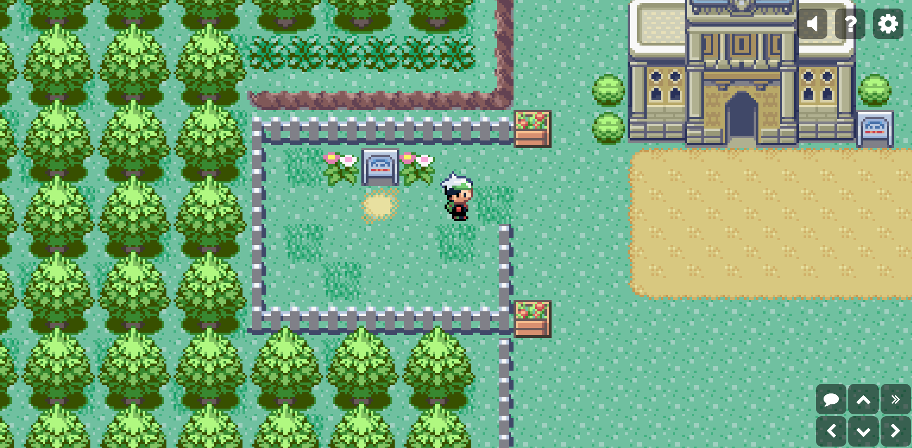
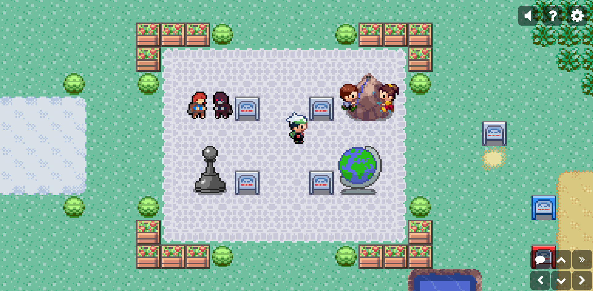

# Pokéfolio

**Pokéfolio** is an interactive portfolio inspired by the visual style of **Pokémon Emerald**. This project is meant to offer a nostalgic and engaging way to showcase my work and skills.
You can check it out [here](https://pokefolio-three.vercel.app).

> ⚠️ **Disclaimer**: This is a personal, non-commercial project. It is **not affiliated with Nintendo, Game Freak, or The Pokémon Company**. All Pokémon-related visual and audio references are used **for demonstration purposes only**, with **no intent to profit**.

---

## 🚀 Technologies Used

- **[TypeScript](https://www.typescriptlang.org/)** — Strongly typed JavaScript
- **[Vite](https://vitejs.dev/)** — Lightning-fast build tool
- **[PixiJS](https://pixijs.com/)** — Fast 2D WebGL rendering engine
- **[Howler.js](https://howlerjs.com/)** — Audio library for the web
- **[Tiled](https://www.mapeditor.org/)** — Open-source 2D level/map editor used for creating the visual layout
- **[Aseprite](https://www.aseprite.org/)** — Pixel art editor
- **[Vercel](https://vercel.com/)** — Deployment and hosting for the website

---

## 📸 Preview




---

## 🧰 Installation

```bash
git clone https://github.com/mperisse27/pokefolio.git
cd pokefolio-ts
npm install
npm run dev
```

The app will be available at http://localhost:5173

## 🎯 Project Goals

- Demonstrate web development skills through creative and immersive UX  
- Explore the capabilities of PixiJS by building an original and playful project  
- Deliver a nostalgic, interactive portfolio experience inspired by a franchise I deeply admire

## 🔒 Legal Notice

This is a fan-made, non-commercial project.
Pokémon, Pokémon Emerald, and all related assets are trademarks of Nintendo, Game Freak, and The Pokémon Company.
No copyright infringement is intended.
If any copyright holder wishes this project to be altered or taken down, I will comply.

## 👤 Author

Matteo Perisse — @mperisse27

## 📫 Contact

Feel free to reach out: matteo.perisse@gmail.com